# Linear-Algebra-for-Deep-Learning
  
# Scalar 
  
A scalar or scalar quantity in physics is a physical quantity that can be described by a single element of a number field such as a real number, often accompanied by units of measurement.  
We usually give scalars lowercase variable names. For example, we might say “Let s ∈ R be the slope of the line,” while defining a real valued scalar, or “Let n ∈ N be the number of units,” while defining a natural number scalar.  
  
# Vector  
  
A vector is an array of numbers. The numbers are arranged in order. We can identify each individual number by its index in that ordering. Typically we give vectors lowercase names in bold typeface, such as **x**.  
We can think of vectors as identifying points in space, with each element giving the coordinate along a different axis.  
  
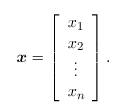  
  
# Matrix
  
A matrix is a 2-D array of numbers, so each element is identified by two indices instead of just one. We usually give matrices uppercase
variable names with bold typeface, such as **A** .  
If a real-valued matrix **A** has a height of m and a width of n, then we say that **A** has an order of m x n.  
  
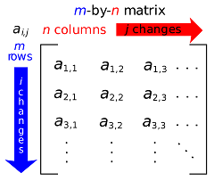  
  
# Tensor  
  
In some cases we will need an array with more than two axes. In the general case, an array of numbers arranged on a regular grid with a variable number of axes is known as a tensor. We denote a tensor named “A” with this typeface : **A**. We identify the element of **A** at coordinates (i,j,k) by writing A<sub>i,j,k</sub> .  
  
# Operations on Matrices and Vectors
  
**Transpose**  
The transpose of a matrix is the mirror image of the matrix across a diagonal line, called the main diagonal, running down and to the right, starting from its upper left corner. We denote the transpose of a matrix **A** by **A**<sup>T</sup> and is defined such that  (**A**<sup>T</sup>)<sub>i,j</sub> =  **A**<sub>j,i</sub>.  
  
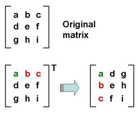  
  
Vectors can be thought of as matrices that contain only one column. The transpose of a vector is therefore a matrix with only one row.
  
```python3
import numpy as np

# defining a matrix
X=np.array([[1,2],[3,4]])

# prints transpose of X
print(X.T)
```
**Addition**  
  
We can add matrices to each other, as long as they have the same shape, just by adding their corresponding elements :  **C** = **A** + **B** , where C<sub>i,j</sub> = A<sub>i,j</sub> + B<sub>i,j</sub>.  
  
  
  
```python3
import numpy as np 

# define matrices 
X=np.array([[1,2],[3,4]])
Y=np.array([[5,6],[7,8]])

print(X)
print(Y)

"""
[[1 2]                                                                                                                                 
 [3 4]]  
 
[[5 6]                                                                                                                        
 [7 8]] 
"""

# add matrices
s = X+Y

print(s)

"""
[[ 6  8]                                                                                                                         
 [10 12]] 
"""
```
    
**Subtraction**  
  
We can subtract a matrix from other, as long as they have the same shape, just by performing subtraction between their corresponding elements :  **C** = **A** - **B** , where C<sub>i,j</sub> = A<sub>i,j</sub> - B<sub>i,j</sub>.  
  
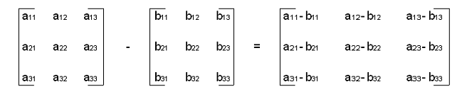  
  
```python3
import numpy as np 

# define matrices 
X=np.array([[1,2],[3,4]])
Y=np.array([[5,6],[7,8]])

print(X)
print(Y)

"""
[[1 2]                                                                                                                                 
 [3 4]]  
 
[[5 6]                                                                                                                        
 [7 8]] 
"""

# subtract matrices
s = X-Y

print(s)

"""
[[ -4  -4]                                                                                                                         
 [-4 -4]] 
"""
```
  
**Scalar Addition and Multiplication**  
  
We can also add a scalar to a matrix or multiply a matrix by a scalar, just by performing that operation on each element of a matrix:  
**D** = a.**B** + c , where D<sub>i,j</sub> = a.B<sub>i,j</sub> + c.  
  
```python3
import numpy as np 

# define matrix
X=np.array([[1,2],[3,4]])

print(X)
"""
[[1 2]                                                                                                                               
 [3 4]]
"""
# scalar multiplication and addition
s = 2*X + 1

print(s)
"""
[[3 5]                                                                                                                                
 [7 9]]
"""
```
  
**Broadcasting**  
  
The addition of a matrix and a vector, yields another matrix:  
**C** = **A** + **b**, where C<sub>i,j</sub> = A<sub>i,j</sub> + b<sub>j</sub>.  In other words, the vector **b** is added to each row of the matrix. This shorthand eliminates the need to define a matrix with **b** copied into each row before doing the addition. This implicit copying of **b**  to many locations is called broadcasting.  
  
```python3
import numpy as np 

# define matrices 
X=np.array([[1,2],[3,4]])
y=np.array([5,6])

print(X)
print(y)
"""
[[1 2]                                                                                                                                  
 [3 4]]                                                                                                                                        
[5 6]
"""

# broadcasting
s = X+y

# result
print(s)
"""
[[ 6  8]                                                                                                                            
 [ 8 10]]
"""
```
  
**Multiplication**  
  
One of the most important operations involving matrices is multiplication of two matrices. The matrix product of matrices **A** and **B** is a third matrix **C**. In order for this product to be defined, **A** must have the same number of columns as **B** has rows. If **A** is of shape m × n and **B** is of shape n × p, then **C** is of shape m × p.  
  
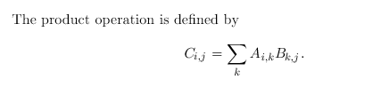  
  
Note that the standard product of two matrices is not just a matrix containing the product of the individual elements. Such an operation exists and is called the element-wise product, or Hadamard product.  
  
* Matrix multiplication is distributive and associative but not commutative.  
  
* The transpose of a matrix product has a simple form: (**AB**)<sup>T</sup>= **B**<sup>T</sup>**A**<sup>T</sup>.  
  
```python3
import numpy as np

# defining the matrices 
X=np.array([[1,2],[3,4]])  # 2 x 2
Y=np.array([[5,6],[7,8]])  # 2 x 2
  
print(X)
print(Y)
"""
[[1 2]                                                                                                                                  
 [3 4]]                                                                                                                                       
[[5 6]                                                                                                                                  
 [7 8]]
"""

# matrix multiplication
mres=np.dot(X,Y)  # 2 x 2
  
print(mres)
"""
[[19 22]                                                                                                                              
 [43 50]]
"""

# element-wise multiplication
eres=np.multiply(X,Y)  # 2 x 2

print(eres)
"""
[[ 5 12]                                                                                                                          
 [21 32]] 
"""
```  
  
# Identity and Inverse Matrices  
  
Linear algebra offers a powerful tool called matrix inversion that enables us to analytically solve system of linear equations **Ax=b** for many values of **A**.  
  
**Identity Matrix**  
  
An identity matrix is a matrix that does not change any vector when we multiply that vector by that matrix. We denote the identity matrix that preserves n-dimensional vectors as **I**<sub>n</sub>.  
  
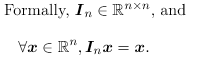  
  
The structure of the identity matrix is simple: all the entries along the main diagonal are 1, while all the other entries are zero.  
  
**Matrix Inverse**  
  
The matrix inverse of **A** is denoted as **A**<sup>−1</sup>, and it is defined as the matrix such that **A**<sup>-1</sup>**A** = **I**.  
We can now solve the system of equations **Ax=b** as,  
  
**Ax = b**  
**A**<sup>-1</sup>**Ax** = **A**<sup>-1</sup>**b**  
**I**<sub>n</sub>**x** = **A**<sup>-1</sup>**b**  
**x** = **A**<sup>-1</sup>**b**  
  
```python3
import numpy as np

# defining an identity matrix
I=np.identity(3)  # 3 x 3

print(I)
"""
[[1. 0. 0.]                                                                                                                            
 [0. 1. 0.]                                                                                                                           
 [0. 0. 1.]]
"""
A=np.array([[1,2],[3,4]])

# matrix inverse
Ai=np.linalg.inv(A)

print(A)
print(Ai)
print(np.dot(A,Ai))
"""
[[1 2]                                                                                                                                 
 [3 4]]                                                                                                                                      
[[-2.   1. ]                                                                                                                           
 [ 1.5 -0.5]]
 
[[1.0000000e+00 0.0000000e+00]                                                                                                        
 [8.8817842e-16 1.0000000e+00]]
"""
```  
  
* **A**<sup>−1</sup> is primarily useful as a theoretical tool, however, and should not actually be used in practice for most software applications. Because **A**<sup>−1</sup> can be represented with only limited precision on a digital computer ( can be inferred from the identity matrix obtained as a result of multiplication of A and Ai in the above code ).  
  
# Linear dependence and Span  
  
**Linear Combination**  
  
Formally, a linear combination of some set of vectors {v<sup>(1)</sup>, . . . , v<sup>(n)</sup>} is given by multiplying each vector v<sup>(i)</sup> by a corresponding scalar coefficient and adding the results.  
  
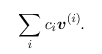  
  
**Span**  
  
The span of a set of vectors is the set of all points obtainable by linear combination of the original vectors.  
Determining whether **Ax**=**b** has a solution thus amounts to testing whether **b**  is in the span of the columns of **A**.  
  
**Linear Dependence**  
  
A set of vectors is linearly dependent if atleast one vector in the set is a linear combination of the other vectors.  
A set of vectors is linearly independent if no vector in the set is a linear combination of the other vectors.  
If we add a vector to a set that is a linear combination of the other vectors in the set, the new vector does not add any points to the set’s span.  
  
# When is a matrix invertible ?  
  
For **A**<sup>−1</sup> to exist, equation **Ax=b** must have exactly one solution for every value of **b**.  
This means that the matrix must be square, that is, we require that m = n ( no. of unknowns = no. of equations ) and that all the columns be linearly independent( i.e A should be non-singular ) .  
  
* A square matrix with linearly dependent columns is known as singular.
  
* If **A** is not square or is square but singular, solving the equation is still possible, but we cannot use the method of matrix inversion to find the solution.  
  
# Norms  
  
Sometimes we need to measure the size of a vector. In machine learning, we usually measure the size of vectors using a function called a
norm. Formally, the L<sup>P</sup> norm is given by,  
  
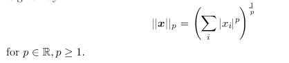  
  
Norms, including the L<sup>p</sup> norm, are functions mapping vectors to non-negative values. On an intuitive level, the norm of a vector x measures the distance from the origin to the point x.  
  
The **L<sup>2</sup> norm**, with p = 2, is known as the Euclidean norm, which is simply the Euclidean distance from the origin to the point identified by x. The L<sup>2</sup> norm is used so frequently in machine learning. In many contexts, the squared L<sup>2</sup>norm may be undesirable because it increases very slowly near the origin.  
  
The **L<sup>1</sup> norm** may be simplified to,  
  
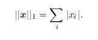  
  
The L<sup>1</sup> norm is commonly used in machine learning when the difference between zero and nonzero elements is very important. Every time an element of x moves away from 0 by q, the L<sup>1</sup>norm increases by q.  
  
One other norm that commonly arises in machine learning is theL<sup>∞</sup> norm, also known as the **max norm**. This norm simplifies to the absolute value of the element with the largest magnitude in the vector,  
  
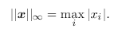  
  
Sometimes we may also wish to measure the size of a matrix. In the context of deep learning, the most common way to do this is with the otherwise obscure **Frobenius norm** :  
  
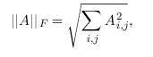  
  
which is analogous to the L<sup>2</sup> norm of a vector.  
  
# Special kinds of matrices and vectors  
  
**Diagonal** matrices  consist mostly of zeros and have nonzero entries only along the main diagonal. Formally, a matrix **D** is diagonal if and only if D<sub>i,j</sub> = 0 for all i != j.  
  
A **symmetric** matrix is any matrix that is equal to its own transpose:  
  
**A** = **A<sup>T</sup>**  
  
A **unit** vector is a vector with unit norm.  
  
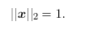  
  
A vector **x** and a vector **y** are **orthogonal** to each other if **x**<sup>T</sup>**y** = 0.  
If the vectors not only are orthogonal but also have unit norm, we call them **orthonormal**.  
  
An **orthogonal matrix** is a square matrix whose rows are mutually orthonormal and whose columns are mutually orthonormal:  
  
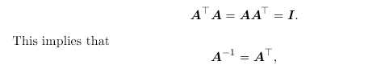  
  
# Trace Operator  
   
 The trace operator gives the sum of all the diagonal entries of a matrix,  
   
 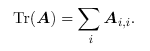  
   
The trace operator is useful for a variety of reasons. Some operations that are difficult to specify without resorting to summation notation can be specified using matrix products and the trace operator. For example, the trace operator provides an alternative way of writing the Frobenius norm of a matrix:  
  
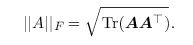  
  


  

  

  


  


  

  

  

  


