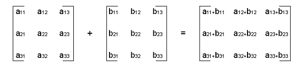

# Linear-Algebra-for-Deep-Learning
  
# Scalar 
  
A scalar or scalar quantity in physics is a physical quantity that can be described by a single element of a number field such as a real number, often accompanied by units of measurement.  
We usually give scalars lowercase variable names. For example, we might say “Let s ∈ R be the slope of the line,” while defining a real valued scalar, or “Let n ∈ N be the number of units,” while defining a natural number scalar.  
  
# Vector  
  
A vector is an array of numbers. The numbers are arranged in order. We can identify each individual number by its index in that ordering. Typically we give vectors lowercase names in bold typeface, such as **x**.  
We can think of vectors as identifying points in space, with each element giving the coordinate along a different axis.  
  
  
  
# Matrix
  
A matrix is a 2-D array of numbers, so each element is identified by two indices instead of just one. We usually give matrices uppercase
variable names with bold typeface, such as **A** .  
If a real-valued matrix **A** has a height of m and a width of n, then we say that **A** has an order of m x n.  
  
  
  
# Tensor  
  
In some cases we will need an array with more than two axes. In the general case, an array of numbers arranged on a regular grid with a variable number of axes is known as a tensor. We denote a tensor named “A” with this typeface : **A**. We identify the element of **A** at coordinates (i,j,k) by writing A<sub>i,j,k</sub> .  
  
# Operations on Matrices and Vectors
  
**Transpose**  
The transpose of a matrix is the mirror image of the matrix across a diagonal line, called the main diagonal, running down and to the right, starting from its upper left corner. We denote the transpose of a matrix **A** by **A**<sup>T</sup> and is defined such that  (**A**<sup>T</sup>)<sub>i,j</sub> =  **A**<sub>j,i</sub>.  
  
  
  
Vectors can be thought of as matrices that contain only one column. The transpose of a vector is therefore a matrix with only one row.
  
```python3
import numpy as np

# defining a matrix
X=np.array([[1,2],[3,4]])

# prints transpose of X
print(X.T)
```
**Addition**  
  
We can add matrices to each other, as long as they have the same shape, just by adding their corresponding elements :  **C** = **A** + **B** , where C<sub>i,j</sub> = A<sub>i,j</sub> + B<sub>i,j</sub>.  
  
  
  
**Subtraction**  
  
We can subtract a matrix from other, as long as they have the same shape, just by performing subtraction between their corresponding elements :  **C** = **A** - **B** , where C<sub>i,j</sub> = A<sub>i,j</sub> - B<sub>i,j</sub>.  
  
  
  
**Scalar Addition and Multiplication**  
  
We can also add a scalar to a matrix or multiply a matrix by a scalar, just by performing that operation on each element of a matrix:  
**D** = a.**B** + c , where D<sub>i,j</sub> = a.B<sub>i,j</sub> + c.  
  
**Broadcasting**  
  
The addition of a matrix and a vector, yields another matrix:  
**C** = **A** + **b**, where C<sub>i,j</sub> = A<sub>i,j</sub> + b<sub>j</sub>.  In other words, the vector **b** is added to each row of the matrix. This shorthand eliminates the need to define a matrix with **b** copied into each row before doing the addition. This implicit copying of **b**  to many locations is called broadcasting.  
  


